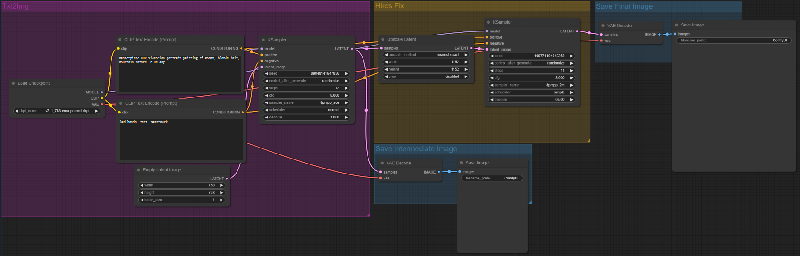
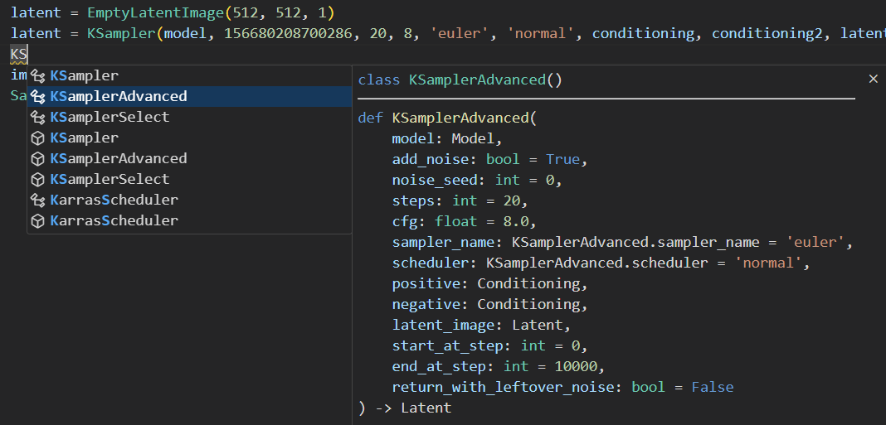

# ComfyScript
A Python front end for [ComfyUI](https://github.com/comfyanonymous/ComfyUI). It has three use cases:
- Serving as a [human-readable format](https://github.com/comfyanonymous/ComfyUI/issues/612) for ComfyUI's workflows.

  This makes it easy to compare and reuse different parts of one's workflows.

  Scripts can be automatically translated from workflows. See [transpiler](#transpiler) for details.

- Directly running the script to generate images.

  The main advantage of doing this is being able to mix Python code with ComfyUI's nodes, like doing loops, calling library functions, and easily encapsulating custom nodes. This also makes adding interaction easier since the UI and logic can be both written in Python. And, some people may feel more comfortable with simple Python code than GUIs.

  The main limitation is that we cannot get the output of nodes from Python before running the full workflow. But if [Node Expansion, While Loops, Components, and Lazy Evaluation #931](https://github.com/comfyanonymous/ComfyUI/pull/931) is someday merged into ComfyUI, this limitation can be solved, and it will be possible to use ComfyUI just like a simple Python library.

  See [runtime](#runtime) for details.

- Retrieving any wanted information by running the script with some stubs.

  For example, to get all positive prompt texts, one can define:

	```python
  positive_prompts = []

	def CLIPTextEncode(text, clip):
	    return text
	
	def KSampler(model, seed, steps, cfg, sampler_name, scheduler, positive, negative, latent_image, denoise):
	    positive_prompts.append(positive)
	```
  And use [`exec()`](https://docs.python.org/3/library/functions.html#exec) to run the script (stubs for other nodes can be automatically generated). This way, `Reroute`, `PrimitiveNode`, and other special nodes won't be a problem stopping one from getting the information.

  It is also possible to generate a JSON by this. However, since JSON can only contain tree data and the workflow is a DAG, some information will have to be discarded, or the input have to be replicated at many positions.

## Installation
```sh
cd D:\ComfyUI\custom_nodes
git clone https://github.com/Chaoses-Ib/ComfyScript.git
cd ComfyScript
python -m pip install -r requirements.txt
```

## Transpiler
The transpiler can translate ComfyUI's workflows to ComfyScript.

When this repository is installed, `SaveImage` and similar nodes will be hooked to automatically save the script as images' metadata.

For example, here is a workflow in ComfyUI:


ComfyScript translated from it:
```python
model, clip, vae = CheckpointLoaderSimple('v1-5-pruned-emaonly.ckpt')
conditioning = CLIPTextEncode('beautiful scenery nature glass bottle landscape, , purple galaxy bottle,', clip)
conditioning2 = CLIPTextEncode('text, watermark', clip)
latent = EmptyLatentImage(512, 512, 1)
latent = KSampler(model, 156680208700286, 20, 8, 'euler', 'normal', conditioning, conditioning2, latent, 1)
image = VAEDecode(latent, vae)
SaveImage(image, 'ComfyUI')
```

If there two or more `SaveImage` nodes in one workflow, only the necessary inputs of each node will be translated to scripts. For example, here is a 2 pass txt2img (hires fix) workflow:



ComfyScript saved for each of the two saved image are respectively:
1. ```python
   model, clip, vae = CheckpointLoaderSimple('v2-1_768-ema-pruned.ckpt')
   conditioning = CLIPTextEncode('masterpiece HDR victorian portrait painting of woman, blonde hair, mountain nature, blue sky', clip)
   conditioning2 = CLIPTextEncode('bad hands, text, watermark', clip)
   latent = EmptyLatentImage(768, 768, 1)
   latent = KSampler(model, 89848141647836, 12, 8, 'dpmpp_sde', 'normal', conditioning, conditioning2, latent, 1)
   image = VAEDecode(latent, vae)
   SaveImage(image, 'ComfyUI')
   ```
2. ```python
   model, clip, vae = CheckpointLoaderSimple('v2-1_768-ema-pruned.ckpt')
   conditioning = CLIPTextEncode('masterpiece HDR victorian portrait painting of woman, blonde hair, mountain nature, blue sky', clip)
   conditioning2 = CLIPTextEncode('bad hands, text, watermark', clip)
   latent = EmptyLatentImage(768, 768, 1)
   latent = KSampler(model, 89848141647836, 12, 8, 'dpmpp_sde', 'normal', conditioning, conditioning2, latent, 1)
   latent2 = LatentUpscale(latent, 'nearest-exact', 1152, 1152, 'disabled')
   latent2 = KSampler(model, 469771404043268, 14, 8, 'dpmpp_2m', 'simple', conditioning, conditioning2, latent2, 0.5)
   image = VAEDecode(latent2, vae)
   SaveImage(image, 'ComfyUI')
   ```

<!--
CLI:
```sh
python -m script from-workflow "D:\workflow.json"
```
-->

## Runtime
With the runtime, you can run ComfyScript like this:
```python
from script import runtime
from script.runtime import *

# await runtime.load('http://127.0.0.1:8188/', locals())
await runtime.load()

async with ComfyScript():
    model, clip, vae = CheckpointLoaderSimple('v1-5-pruned-emaonly.ckpt')
    conditioning = CLIPTextEncode('beautiful scenery nature glass bottle landscape, , purple galaxy bottle,', clip)
    conditioning2 = CLIPTextEncode('text, watermark', clip)
    latent = EmptyLatentImage(512, 512, 1)
    latent = KSampler(model, 156680208700286, 20, 8, 'euler', 'normal', conditioning, conditioning2, latent, 1)
    image = VAEDecode(latent, vae)
    SaveImage(image, 'ComfyUI')
```

A Jupyter Notebook example is available at [runtime.ipynb](runtime.ipynb).

- [Type stubs](https://typing.readthedocs.io/en/latest/source/stubs.html) will be generated at [`script/runtime/__init__.pyi`](script/runtime/__init__.pyi) after loading. Mainstream editors can use them to help with coding:

  

- The runtime is asynchronous by default. You can queue multiple prompts without waiting for the first one to finish. A daemon thread will watch and report the remaining prompts in the queue and the current progress, for example:
  ```
  Queue remaining: 1
  Queue remaining: 2
  100%|██████████████████████████████████████████████████| 20/20
  Queue remaining: 1
  100%|██████████████████████████████████████████████████| 20/20
  Queue remaining: 0
  ```

## Other nodes
These nodes can be used without ComfyScript.

### Load Image From Path
ComfyUI's built-in `Load Image` node can only load uploaded images, which produces duplicated files in the input directory and cannot reload the image when the source file is changed. `Load Image From Path` instead loads the image from the source path and does not have such problems.

One use of this node is to work with Photoshop's [Quick Export](https://helpx.adobe.com/photoshop/using/export-artboards-layers.html#:~:text=in%20Photoshop.-,Quick%20Export%20As,-Use%20the%20Quick) to quickly perform img2img/inpaint on the edited image. Update: For working with Photoshop, [comfyui-photoshop](https://github.com/NimaNzrii/comfyui-photoshop) is more convenient and supports waiting for changes. See [tutorial at r/comfyui](https://www.reddit.com/r/comfyui/comments/18jygtn/new_ai_news_photoshop_to_comfyui_v1_is_finally/).

The image path can be in the following format:
- Absolute path:

  `D:\ComfyUI\output\ComfyUI_00001_-assets\ComfyUI_00001_.png`

- Relative to the input directory:

  `ComfyUI_00001_-assets\ComfyUI_00001_.png [input]`

- Relative to the output directory:

  `ComfyUI_00001_-assets\ComfyUI_00001_.png [output]`

- Relative to the temp directory:

  `ComfyUI_00001_-assets\ComfyUI_00001_.png [temp]`