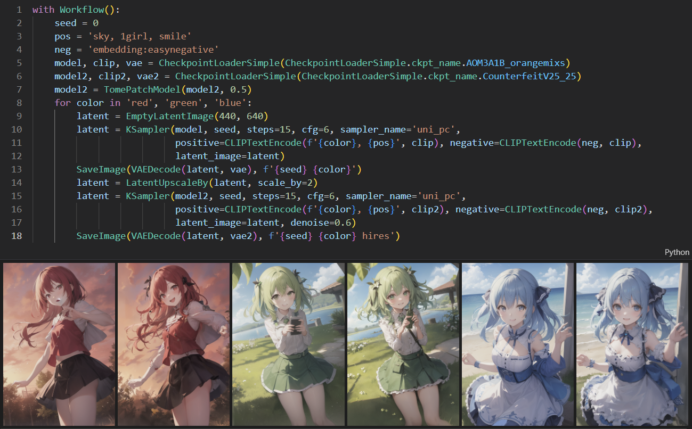
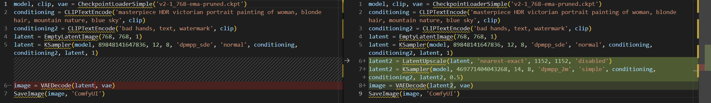
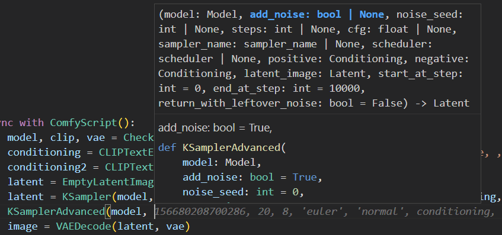
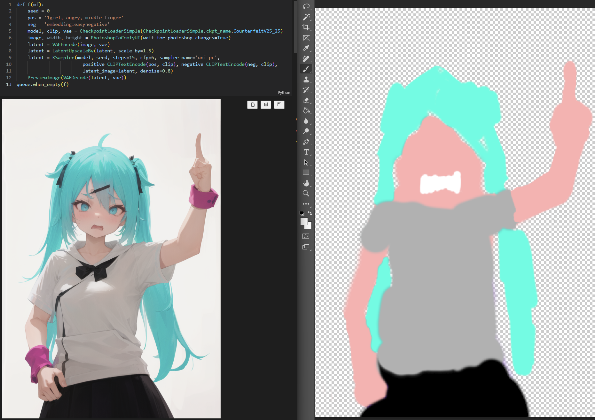
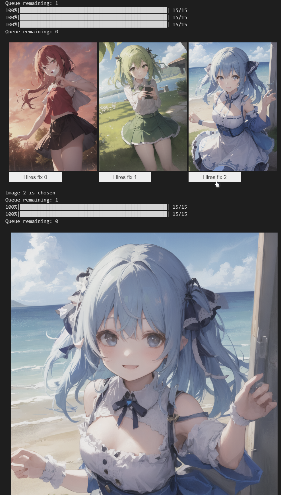
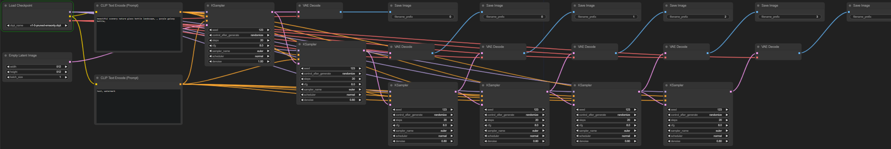

# ComfyScript
A Python front end for [ComfyUI](https://github.com/comfyanonymous/ComfyUI).



It has the following use cases:
- Serving as a [human-readable format](https://github.com/comfyanonymous/ComfyUI/issues/612) for ComfyUI's workflows.

  This makes it easy to compare and reuse different parts of one's workflows.

  Scripts can be automatically translated from workflows. See [transpiler](#transpiler) for details.

- Directly running the script to generate images.

  The main advantage of doing this is being able to mix Python code with ComfyUI's nodes, like doing loops, calling library functions, and easily encapsulating custom nodes. This also makes adding interaction easier since the UI and logic can be both written in Python. And, some people may feel more comfortable with simple Python code than a graph-based GUI.

  The main limitation is that we cannot get the output of nodes from Python before running the full workflow. However, this limitation can be mitigated by expanding a workflow dynamically and run it multiple times. (If [#931](https://github.com/comfyanonymous/ComfyUI/pull/931) is someday merged into ComfyUI, this limitation can be solved, and it will be possible to use ComfyUI just like a simple Python library.)

  See [runtime](#runtime) for details and [select and process](#select-and-process) for an example of how to mitigate the limitation.

- Generating workflows with scripts.

  You can run scripts to generate workflows and then use them in the web UI or elsewhere. This way, you can use loops and generate huge workflows where it would be time-consuming or impractical to create them manually. See [workflow generation](#workflow-generation) for details.

- Retrieving any wanted information by running the script with some stubs.

  For example, to get all positive prompt texts, one can define:

  ```python
  positive_prompts = []

  def CLIPTextEncode(text, clip):
      return text
  
  def KSampler(model, seed, steps, cfg, sampler_name, scheduler, positive, negative, latent_image, denoise):
      positive_prompts.append(positive)
  ```
  And use [`exec()`](https://docs.python.org/3/library/functions.html#exec) to run the script (stubs for other nodes can be automatically generated). This way, `Reroute`, `PrimitiveNode`, and other special nodes won't be a problem stopping one from getting the information.

  It is also possible to generate a JSON by this. However, since JSON can only contain tree data and the workflow is a DAG, some information will have to be discarded, or the input have to be replicated at many positions.

- Converting workflows from ComfyUI's web UI format to API format without the web UI.

## Installation
Install [ComfyUI](https://github.com/comfyanonymous/ComfyUI) first. And then:
```sh
cd ComfyUI/custom_nodes
git clone --recurse-submodules https://github.com/Chaoses-Ib/ComfyScript.git
cd ComfyScript
python -m pip install -r requirements.txt
```
Minimum Python version: 3.9 (ComfyUI's minimum version is 3.8)

Update:
```sh
cd ComfyUI/custom_nodes/ComfyScript
git pull
python -m pip install -r requirements.txt
```

## Transpiler
The transpiler can translate ComfyUI's workflows to ComfyScript.

When this repository is installed, `SaveImage` and similar nodes will be hooked to automatically save the script as images' metadata. And the script will also be output to the terminal.

For example, here is a workflow in ComfyUI:


ComfyScript translated from it:
```python
model, clip, vae = CheckpointLoaderSimple('v1-5-pruned-emaonly.ckpt')
conditioning = CLIPTextEncode('beautiful scenery nature glass bottle landscape, , purple galaxy bottle,', clip)
conditioning2 = CLIPTextEncode('text, watermark', clip)
latent = EmptyLatentImage(512, 512, 1)
latent = KSampler(model, 156680208700286, 20, 8, 'euler', 'normal', conditioning, conditioning2, latent, 1)
image = VAEDecode(latent, vae)
SaveImage(image, 'ComfyUI')
```

If there two or more `SaveImage` nodes in one workflow, only the necessary inputs of each node will be translated to scripts. For example, here is a 2 pass txt2img (hires fix) workflow:


ComfyScript saved for each of the two saved image are respectively:
1. ```python
   model, clip, vae = CheckpointLoaderSimple('v2-1_768-ema-pruned.ckpt')
   conditioning = CLIPTextEncode('masterpiece HDR victorian portrait painting of woman, blonde hair, mountain nature, blue sky', clip)
   conditioning2 = CLIPTextEncode('bad hands, text, watermark', clip)
   latent = EmptyLatentImage(768, 768, 1)
   latent = KSampler(model, 89848141647836, 12, 8, 'dpmpp_sde', 'normal', conditioning, conditioning2, latent, 1)
   image = VAEDecode(latent, vae)
   SaveImage(image, 'ComfyUI')
   ```
2. ```python
   model, clip, vae = CheckpointLoaderSimple('v2-1_768-ema-pruned.ckpt')
   conditioning = CLIPTextEncode('masterpiece HDR victorian portrait painting of woman, blonde hair, mountain nature, blue sky', clip)
   conditioning2 = CLIPTextEncode('bad hands, text, watermark', clip)
   latent = EmptyLatentImage(768, 768, 1)
   latent = KSampler(model, 89848141647836, 12, 8, 'dpmpp_sde', 'normal', conditioning, conditioning2, latent, 1)
   latent2 = LatentUpscale(latent, 'nearest-exact', 1152, 1152, 'disabled')
   latent2 = KSampler(model, 469771404043268, 14, 8, 'dpmpp_2m', 'simple', conditioning, conditioning2, latent2, 0.5)
   image = VAEDecode(latent2, vae)
   SaveImage(image, 'ComfyUI')
   ```

Comparing scripts:



You can also use the transpiler via the [CLI](script/transpile/README.md#cli).

## Runtime
With the runtime, you can run ComfyScript like this:
```python
from script.runtime import *
load()
from script.runtime.nodes import *

with Workflow():
    model, clip, vae = CheckpointLoaderSimple('v1-5-pruned-emaonly.ckpt')
    conditioning = CLIPTextEncode('beautiful scenery nature glass bottle landscape, , purple galaxy bottle,', clip)
    conditioning2 = CLIPTextEncode('text, watermark', clip)
    latent = EmptyLatentImage(512, 512, 1)
    latent = KSampler(model, 156680208700286, 20, 8, 'euler', 'normal', conditioning, conditioning2, latent, 1)
    image = VAEDecode(latent, vae)
    SaveImage(image, 'ComfyUI')
```

A Jupyter Notebook example is available at [runtime.ipynb](runtime.ipynb).

- [Type stubs](https://typing.readthedocs.io/en/latest/source/stubs.html) will be generated at `script/runtime/nodes.pyi` after loading. Mainstream code editors (e.g. [VS Code](https://code.visualstudio.com/docs/languages/python)) can use them to help with coding:

  | | |
  | --- | --- |
  |  |  |

  [Enumerations](https://docs.python.org/3/library/enum.html) are generated for all arguments provding the value list. So instead of copying and pasting strings like `'v1-5-pruned-emaonly.ckpt'`, you can use:
  ```python
  CheckpointLoaderSimple.ckpt_name.v1_5_pruned_emaonly
  ```

- The runtime is asynchronous by default. You can queue multiple tasks without waiting for the first one to finish. A daemon thread will watch and report the remaining tasks in the queue and the current progress, for example:
  ```
  Queue remaining: 1
  Queue remaining: 2
  100%|██████████████████████████████████████████████████| 20/20
  Queue remaining: 1
  100%|██████████████████████████████████████████████████| 20/20
  Queue remaining: 0
  ```
  Some control functions are also available:
  ```python
  # Interrupt the current task
  queue.cancel_current()
  # Clear the queue
  queue.cancel_remaining()
  # Interrupt the current task and clear the queue
  queue.cancel_all()
  # Call the callback when the queue is empty
  queue.when_empty(callback)

  # With Workflow:
  Workflow(cancel_remaining=True)
  Workflow(cancel_all=True)
  ```

### Differences from ComfyUI's web UI
In ComfyUI, the back end and the web UI use different formats of workflows. Things like "S&R" (Search and Replace), "mute", "bypass" and "group" only exist in the web UI's format, not in the back end's API format. Before sending the workflows to the back end, the web UI will perform S&R, remove muted and bypassed nodes, and ignore groups as they are just UI elements that have no effect on the back end.

In ComfyScript, S&R can be implemented with variables and [f-strings](https://docs.python.org/3/tutorial/inputoutput.html#formatted-string-literals):
```python
pos = 'beautiful scenery nature glass bottle landscape, , purple galaxy bottle,'
neg = 'text, watermark'
seed = 123
steps = 20
model, clip, vae = CheckpointLoaderSimple('v1-5-pruned-emaonly.ckpt')
latent = EmptyLatentImage(512, 512, 1)
latent = KSampler(model, seed, steps, 8, 'euler', 'normal', CLIPTextEncode(pos, clip), CLIPTextEncode(neg, clip), latent, 1)
SaveImage(VAEDecode(latent, vae), f'{seed} {steps}')
```

For mute and bypass, you can comment the code (<kbd><kbd>Ctrl</kbd>+<kbd>/</kbd></kbd> in VS Code):
```python
model, clip, vae = CheckpointLoaderSimple('v1-5-pruned-emaonly.ckpt')
conditioning = CLIPTextEncode('beautiful scenery nature glass bottle landscape, , purple galaxy bottle,', clip)
conditioning2 = CLIPTextEncode('text, watermark', clip)
latent = EmptyLatentImage(512, 512, 1)

# "mute"
# latent = KSampler(model, 156680208700286, 20, 8, 'euler', 'normal', conditioning, conditioning2, latent, 1)
# image = VAEDecode(latent, vae)
# SaveImage(image, 'ComfyUI')

# "bypass"
# latent = KSampler(model, 156680208700286, 20, 8, 'euler', 'normal', conditioning, conditioning2, latent, 1)
image = VAEDecode(latent, vae)
SaveImage(image, 'ComfyUI')
```
Or use `if`:
```python
sample = False
save = True

model, clip, vae = CheckpointLoaderSimple('v1-5-pruned-emaonly.ckpt')
conditioning = CLIPTextEncode('beautiful scenery nature glass bottle landscape, , purple galaxy bottle,', clip)
conditioning2 = CLIPTextEncode('text, watermark', clip)
latent = EmptyLatentImage(512, 512, 1)
if sample:
    latent = KSampler(model, 156680208700286, 20, 8, 'euler', 'normal', conditioning, conditioning2, latent, 1)
if save:
    image = VAEDecode(latent, vae)
    SaveImage(image, 'ComfyUI')
```

For groups, you can just put related code together:
```python
pos = 'beautiful scenery nature glass bottle landscape, , purple galaxy bottle,'
neg = 'text, watermark'

# Model
model, clip, vae = CheckpointLoaderSimple('v1-5-pruned-emaonly.ckpt')

# Sampling
seed = 123
steps = 20
latent = EmptyLatentImage(512, 512, 1)
latent = KSampler(model, seed, steps, 8, 'euler', 'normal', CLIPTextEncode(pos, clip), CLIPTextEncode(neg, clip), latent, 1)

# Save
SaveImage(VAEDecode(latent, vae), f'{seed} {steps}')
```
Or define functions:
```python
def generate_image(pos, neg, seed, steps):
    model, clip, vae = CheckpointLoaderSimple('v1-5-pruned-emaonly.ckpt')
    latent = EmptyLatentImage(512, 512, 1)
    latent = KSampler(model, seed, steps, 8, 'euler', 'normal', CLIPTextEncode(pos, clip), CLIPTextEncode(neg, clip), latent, 1)
    SaveImage(VAEDecode(latent, vae), f'{seed} {steps}')

pos = 'beautiful scenery nature glass bottle landscape, , purple galaxy bottle,'
neg = 'text, watermark'
generate_image(pos, neg, seed=123, steps=20)
```

Also, for multiple line strings and raw strings:
```python
pos = '''beautiful scenery nature glass bottle landscape, 
purple galaxy bottle,'''
# or
pos = (
'''beautiful scenery nature glass bottle landscape, 
purple galaxy bottle,''')

image = LoadImageFromPath(r'ComfyUI_00001_-assets\ComfyUI_00001_.png [output]')
```

### Examples
#### Auto queue
Automatically queue new workflows when the queue becomes empty.

For example, one can use [comfyui-photoshop](https://github.com/NimaNzrii/comfyui-photoshop) (currently a bit buggy) to automatically do img2img with the image in Photoshop when it changes:
```python
def f(wf):
    seed = 0
    pos = '1girl, angry, middle finger'
    neg = 'embedding:easynegative'
    model, clip, vae = CheckpointLoaderSimple(CheckpointLoaderSimple.ckpt_name.CounterfeitV25_25)
    image, width, height = PhotoshopToComfyUI(wait_for_photoshop_changes=True)
    latent = VAEEncode(image, vae)
    latent = LatentUpscaleBy(latent, scale_by=1.5)
    latent = KSampler(model, seed, steps=15, cfg=6, sampler_name='uni_pc',
                        positive=CLIPTextEncode(pos, clip), negative=CLIPTextEncode(neg, clip),
                        latent_image=latent, denoise=0.8)
    PreviewImage(VAEDecode(latent, vae))
queue.when_empty(f)
```
Screenshot:



#### Select and process
For example, to generate 3 images at once, and then let the user decide which ones they want to hires fix:
```python
import ipywidgets as widgets

queue.watch_display(False, False)

latents = []
image_batches = []
with Workflow():
    seed = 0
    pos = 'sky, 1girl, smile'
    neg = 'embedding:easynegative'
    model, clip, vae = CheckpointLoaderSimple(CheckpointLoaderSimple.ckpt_name.AOM3A1B_orangemixs)
    model2, clip2, vae2 = CheckpointLoaderSimple(CheckpointLoaderSimple.ckpt_name.CounterfeitV25_25)
    for color in 'red', 'green', 'blue':
        latent = EmptyLatentImage(440, 640)
        latent = KSampler(model, seed, steps=15, cfg=6, sampler_name='uni_pc',
                          positive=CLIPTextEncode(f'{color}, {pos}', clip), negative=CLIPTextEncode(neg, clip),
                          latent_image=latent)
        latents.append(latent)
        image_batches.append(SaveImage(VAEDecode(latent, vae), f'{seed} {color}'))

grid = widgets.GridspecLayout(1, len(image_batches))
for i, image_batch in enumerate(image_batches):
    image_batch = image_batch.wait()
    image = widgets.Image(value=image_batch[0]._repr_png_())

    button = widgets.Button(description=f'Hires fix {i}')
    def hiresfix(button, i=i):
        print(f'Image {i} is chosen')
        with Workflow():
            latent = LatentUpscaleBy(latents[i], scale_by=2)
            latent = KSampler(model2, seed, steps=15, cfg=6, sampler_name='uni_pc',
                            positive=CLIPTextEncode(pos, clip2), negative=CLIPTextEncode(neg, clip2),
                            latent_image=latent, denoise=0.6)
            image_batch = SaveImage(VAEDecode(latent, vae2), f'{seed} hires')
        display(image_batch.wait())
    button.on_click(hiresfix)

    grid[0, i] = widgets.VBox(children=(image, button))
display(grid)
```
This example uses [ipywidgets](https://github.com/jupyter-widgets/ipywidgets) for the GUI, but other GUI frameworks can be used as well.

Screenshot:



### Workflow generation
In the [runtime](#runtime), you can get a workflow's API format by calling `api_format_json()`. For example, to generate a loopback (do multiple times img2img on the same image) workflow:
```python
with Workflow(queue=False) as wf:
    model, clip, vae = CheckpointLoaderSimple('v1-5-pruned-emaonly.ckpt')
    conditioning = CLIPTextEncode('beautiful scenery nature glass bottle landscape, , purple galaxy bottle,', clip)
    conditioning2 = CLIPTextEncode('text, watermark', clip)
    latent = EmptyLatentImage(512, 512, 1)
    latent = KSampler(model, 123, 20, 8, 'euler', 'normal', conditioning, conditioning2, latent, 1)
    SaveImage(VAEDecode(latent, vae), '0')
    for i in range(5):
        latent = KSampler(model, 123, 20, 8, 'euler', 'normal', conditioning, conditioning2, latent, 0.8)
        SaveImage(VAEDecode(latent, vae), f'{i}')

json = wf.api_format_json()
with open('prompt.json', 'w') as f:
    f.write(json)
```
This only generates workflows in the API format. But ComfyUI can automically convert API format workflows to the web UI format when you load them ([#1932](https://github.com/comfyanonymous/ComfyUI/pull/1932)):



You can also load workflows from images generated by ComfyScript.

Note: You may get slightly different results when using the generated workflow in the web UI compared to using it in ComfyScript. See [other differences from ComfyUI's web UI](script/runtime/README.md#other-differences-from-comfyuis-web-ui) for the reason.

## Other nodes
These nodes are installed to help with ComfyScript. But if you want, you can also use them in ComfyUI's web UI.

### [ComfyUI_Ib_CustomNodes](https://github.com/Chaoses-Ib/ComfyUI_Ib_CustomNodes)
#### [Load Image From Path](https://github.com/Chaoses-Ib/ComfyUI_Ib_CustomNodes#load-image-from-path)
```python
def LoadImageFromPath(
    image: str = r'ComfyUI_00001_-assets\ComfyUI_00001_.png [output]'
) -> tuple[Image, Mask]
```
One use of this node is to work with Photoshop's [Quick Export](https://helpx.adobe.com/photoshop/using/export-artboards-layers.html#:~:text=in%20Photoshop.-,Quick%20Export%20As,-Use%20the%20Quick) to quickly perform img2img/inpaint on the edited image. Update: For working with Photoshop, [comfyui-photoshop](https://github.com/NimaNzrii/comfyui-photoshop) is more convenient and supports waiting for changes. See [tutorial at r/comfyui](https://www.reddit.com/r/comfyui/comments/18jygtn/new_ai_news_photoshop_to_comfyui_v1_is_finally/).

### [ComfyUI Nodes for External Tooling](https://github.com/Acly/comfyui-tooling-nodes)
Nodes for working on regions:
```python
def ETNCropImage(
    image: Image,
    x: int = 0,
    y: int = 0,
    width: int = 512,
    height: int = 512
) -> Image

def ETNApplyMaskToImage(
    image: Image,
    mask: Mask
) -> Image
```
Nodes for sending and receiving images:
```python
def ETNLoadImageBase64(
    image: str
) -> tuple[Image, Mask]

def ETNLoadMaskBase64(
    mask: str
) -> Mask

# Sends an output image over the client WebSocket connection as PNG binary data.
def ETNSendImageWebSocket(
    images: Image
)
```