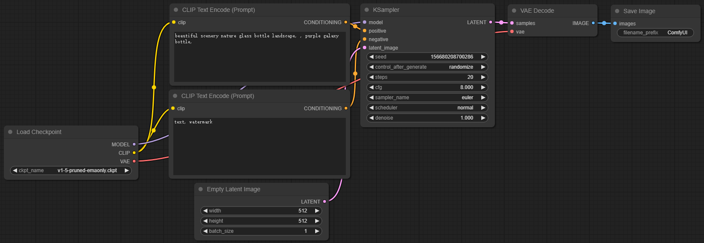
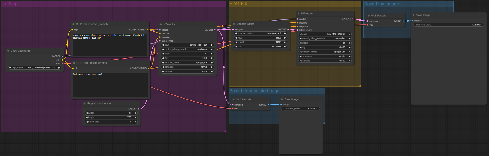
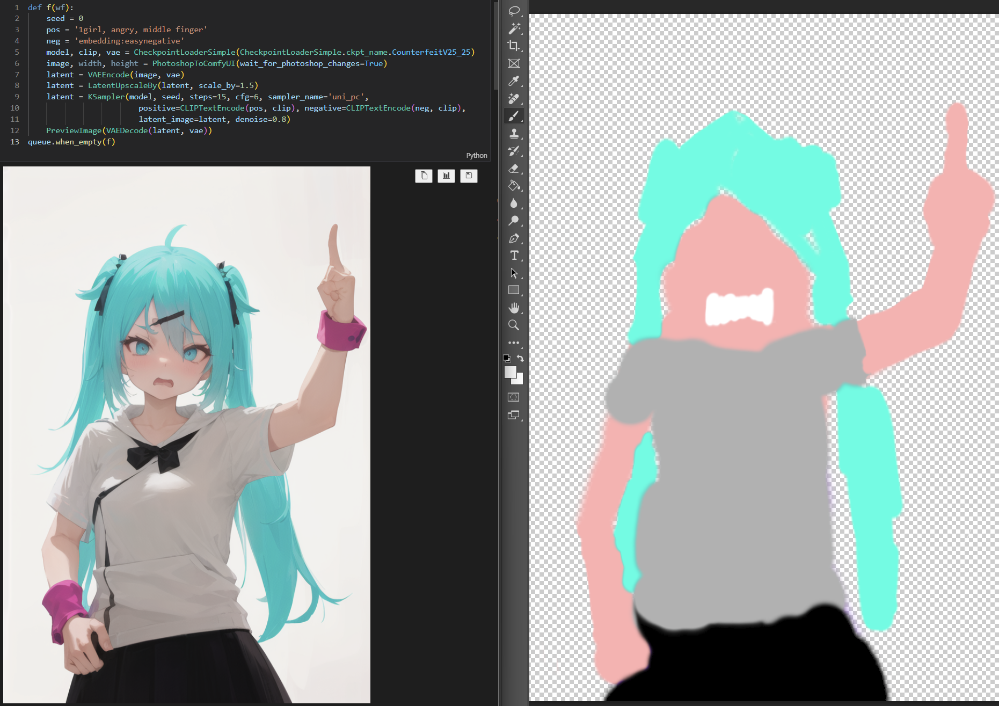
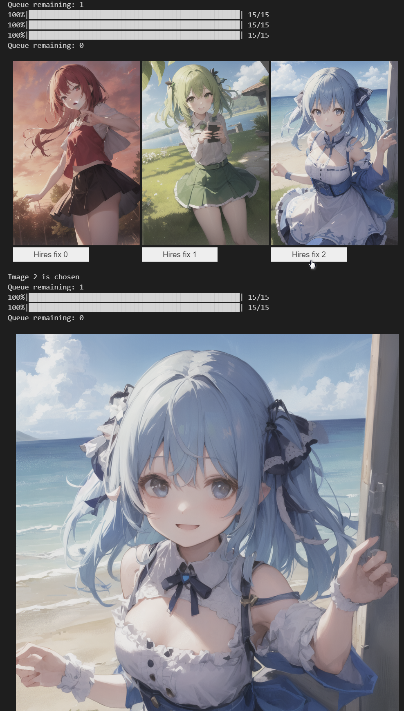
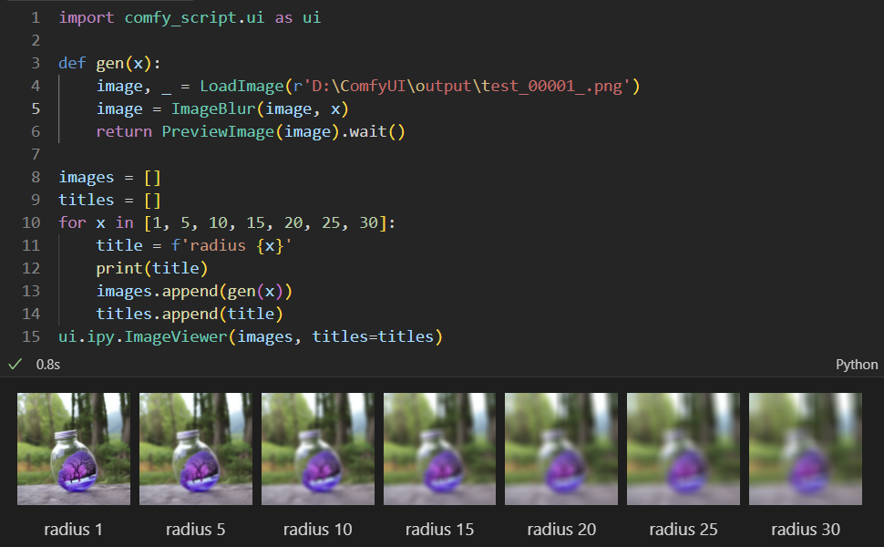
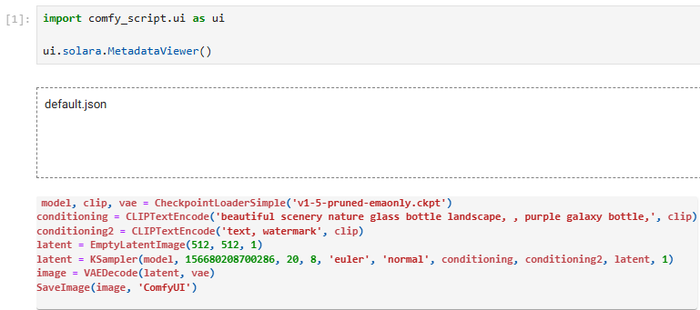

# ComfyScript
[](https://pypi.org/project/comfy-script)  [](LICENSE.txt)

A Python frontend and library for [ComfyUI](https://github.com/comfyanonymous/ComfyUI).


It has the following use cases:
- Serving as a [human-readable format](https://github.com/comfyanonymous/ComfyUI/issues/612) for ComfyUI's workflows.

  This makes it easy to compare and reuse different parts of one's workflows.
  
  It is also possible to train LLMs to generate workflows, since many LLMs can handle Python code relatively well. This approach can be more powerful than just asking LLMs for some hardcoded parameters.

  Scripts can be automatically translated from ComfyUI's workflows. See [transpiler](#transpiler) for details.

- Directly running the script to generate images.

  The main advantage of doing this than using the web UI is being able to mix Python code with ComfyUI's nodes, such as doing loops, calling library functions, and easily encapsulating custom nodes. This also makes adding interaction easier since the UI and logic can be both written in Python. And, some people may feel more comfortable with simple Python code than a graph-based GUI.[^graph-gui]

  See [runtime](#runtime) for details. Scripts can be executed locally or remotely with a ComfyUI server.

- Using ComfyUI as a function library.

  With ComfyScript, ComfyUI's nodes can be used as functions to do ML research, reuse nodes in other projects, debug custom nodes, and optimize caching to run workflows faster.

  See runtime's [real mode](docs/Runtime.md#real-mode) for details.

- Generating ComfyUI's workflows with scripts.

  Scripts can also be used to generate ComfyUI's workflows and then used in the web UI or elsewhere. This way, one can use loops and generate huge workflows where it would be time-consuming or impractical to create them manually. See [workflow generation](docs/Runtime.md#workflow-generation) for details. It is also possible to load workflows from images generated by ComfyScript.

- Retrieving any wanted information by running the script with some stubs.

  See [workflow information retrieval](docs/README.md#workflow-information-retrieval) for details.

- Converting workflows from ComfyUI's web UI format to API format without the web UI.

## [Documentation](docs/README.md)
- [Runtime](docs/Runtime.md)
- [Images](docs/Images/README.md)
- [Models](docs/Models/README.md)
- [Additional Nodes](docs/Nodes/README.md)
- [Transpiler](docs/Transpiler.md)
- UI
  - [ipywidgets UI](docs/UI/ipywidgets.md)
  - [Solara UI](docs/UI/Solara.md)
- [Examples](examples/README.md)
- [Differences from ComfyUI-to-Python-Extension](docs/README.md#differences-from-comfyui-to-python-extension)

## Installation
### Installing only ComfyScript package
If you only want to use ComfyScript with an external ComfyUI server,
like using cloud ComfyUI servers and developing apps/libraries:

<details>

Install Python first.

Install/update ComfyScript:
```sh
python -m pip install -U "comfy-script[default]"
```

Save and run [the following code](examples/runtime.py) to test (e.g. `python examples/runtime.py`):
```py
from comfy_script.runtime import *
# ComfyUI server/path
# or: load(r'path/to/ComfyUI')
load('http://127.0.0.1:8188/')
from comfy_script.runtime.nodes import *

with Workflow(wait=True):
    image = EmptyImage()
    images = util.get_images(image, save=True)
```

Or without installing Python, directly use ComfyScript with [uv](https://docs.astral.sh/uv/):
```sh
uv run examples/uv.py
```
[`examples/uv.py`](examples/uv.py):
```python
# /// script
# requires-python = ">=3.9"
# dependencies = [
#     "comfy-script[default]",
# ]
# ///
from comfy_script.runtime import *
load('http://127.0.0.1:8188/')
from comfy_script.runtime.nodes import *

with Workflow(wait=True):
    image = EmptyImage()
    images = util.get_images(image, save=True)
```

See [installing only ComfyScript package](docs/README.md#installing-only-comfyscript-package) for details.

</details>

### Installing with ComfyUI
If you have Python/ComfyUI installed:

<details>

If you haven't installed ComfyUI, install it first.
See [ComfyUI Installing](https://github.com/comfyanonymous/ComfyUI#installing)
or use [Comfy-Cli](https://github.com/Comfy-Org/comfy-cli) to install:
```sh
python -m pip install comfy-cli
comfy --here install
```
And then run the following commands to install ComfyScript:
```sh
cd ComfyUI/custom_nodes
git clone https://github.com/Chaoses-Ib/ComfyScript.git
cd ComfyScript
python -m pip install -e ".[default]"
```

Update:
```sh
cd ComfyUI/custom_nodes/ComfyScript
git pull
python -m pip install -e ".[default]"
```

`[default]` is necessary to install common dependencies. See [`pyproject.toml`](pyproject.toml) for other options. If no option is specified, ComfyScript will be installed without any dependencies.

</details>

### Installing with ComfyUI & uv venv
If you haven't installed Python/ComfyUI, you can use [uv](https://docs.astral.sh/uv/), a fast Python package and project manager, to install ComfyUI and ComfyScript:

<details>

[Install uv](https://docs.astral.sh/uv/getting-started/installation/) first. Then create a venv, install Comfy-Cli and ComfyUI:
```sh
mkdir ComfyUI
cd ComfyUI
uv venv --seed --python 3.12
uv pip install comfy-cli
uv run comfy --workspace . install

# (Optional) Start ComfyUI to test
# uv run main.py
```

Install ComfyScript:
```sh
git clone https://github.com/Chaoses-Ib/ComfyScript.git ./custom_nodes/ComfyScript
uv pip install -e "./custom_nodes/ComfyScript[default]"
```

Update ComfyScript:
```sh
git -C "./custom_nodes/ComfyScript" pull
uv pip install -e "./custom_nodes/ComfyScript[default]"
```

`[default]` is necessary to install common dependencies. See [`pyproject.toml`](pyproject.toml) for other options. If no option is specified, ComfyScript will be installed without any dependencies.

Note uv can only discover the ComfyUI venv when the working directory is `ComfyUI` or `ComfyUI/*`. To use the venv in other directories, like in `ComfyUI/custom_nodes/ComfyScript` or your script directory, you need to activate it manually:
```pwsh
cd ComfyUI
# Windows
.\.venv\Scripts\activate
# Linux
source .venv/bin/activate
```

See [VS Code](docs/README.md#vs-code) if you have problems when using ComfyScript in VS Code.
</details>

### Installing with ComfyUI package
If you want to install ComfyUI as a pip package:

<details>

Install [ComfyUI package](https://github.com/hiddenswitch/ComfyUI) first:
- If PyTorch is not installed:

  ```sh
  python -m pip install git+https://github.com/hiddenswitch/ComfyUI.git
  ```
- If PyTorch is already installed (e.g. Google Colab):

  ```sh
  python -m pip install wheel
  python -m pip install --no-build-isolation git+https://github.com/hiddenswitch/ComfyUI.git
  ```

Install/update ComfyScript:
```sh
python -m pip install -U "comfy-script[default]"
```

`[default]` is necessary to install common dependencies. See [`pyproject.toml`](pyproject.toml) for other options. If no option is specified, ComfyScript will be installed without any dependencies.

If there are problems with the latest ComfyUI package, one can use the last tested version:
```
python -m pip install --no-build-isolation git+https://github.com/hiddenswitch/ComfyUI.git@95a12f42e2b0c78202af10f2337009bd769157a7
```
</details>

### Containers
- [Modal](examples/modal.py) by @the-dream-machine (ComfyUI + Comfy-Cli)
- [promeG/comfyui: ComfyUI docker images](https://github.com/promeG/comfyui)

### Others
See [troubleshooting](docs/README.md#troubleshooting) and [VS Code](docs/README.md#vs-code) if you encountered any problems.
To uninstall, see [uninstallation](docs/README.md#uninstallation).

## Transpiler
The transpiler can translate ComfyUI's workflows to ComfyScript.

When ComfyScript is installed as custom nodes, `SaveImage` and similar nodes will be hooked to automatically save the script as the image's metadata. The script will also be printed to the terminal.

If you installed ComfyScript outside of ComfyUI, you can still use the transpiler by:
- [CLI](docs/Transpiler.md#cli)
  ```sh
  python -m comfy_script.transpile "workflow.json" --api http://127.0.0.1:8188/
  ```
  Or without installing ComfyScript, directly with uv:
  ```sh
  uvx --from "comfy-script[default]" python -m comfy_script.transpile "workflow.json" --api http://127.0.0.1:8188/
  ```
- [Python code](docs/Transpiler.md#from-python-code)
- Jupyter Notebook / web: [MetadataViewer](#metadataviewer)

For example, here is a workflow in ComfyUI:



ComfyScript translated from it:
```python
model, clip, vae = CheckpointLoaderSimple('v1-5-pruned-emaonly.ckpt')
conditioning = CLIPTextEncode('beautiful scenery nature glass bottle landscape, , purple galaxy bottle,', clip)
conditioning2 = CLIPTextEncode('text, watermark', clip)
latent = EmptyLatentImage(512, 512, 1)
latent = KSampler(model, 156680208700286, 20, 8, 'euler', 'normal', conditioning, conditioning2, latent, 1)
image = VAEDecode(latent, vae)
SaveImage(image, 'ComfyUI')
```

If there two or more `SaveImage` nodes in one workflow, only the necessary inputs of each node will be translated to scripts. For example, here is a 2 pass txt2img (hires fix) workflow:



ComfyScript saved for each of the two saved image are respectively:
1. ```python
   model, clip, vae = CheckpointLoaderSimple('v2-1_768-ema-pruned.ckpt')
   conditioning = CLIPTextEncode('masterpiece HDR victorian portrait painting of woman, blonde hair, mountain nature, blue sky', clip)
   conditioning2 = CLIPTextEncode('bad hands, text, watermark', clip)
   latent = EmptyLatentImage(768, 768, 1)
   latent = KSampler(model, 89848141647836, 12, 8, 'dpmpp_sde', 'normal', conditioning, conditioning2, latent, 1)
   image = VAEDecode(latent, vae)
   SaveImage(image, 'ComfyUI')
   ```
2. ```python
   model, clip, vae = CheckpointLoaderSimple('v2-1_768-ema-pruned.ckpt')
   conditioning = CLIPTextEncode('masterpiece HDR victorian portrait painting of woman, blonde hair, mountain nature, blue sky', clip)
   conditioning2 = CLIPTextEncode('bad hands, text, watermark', clip)
   latent = EmptyLatentImage(768, 768, 1)
   latent = KSampler(model, 89848141647836, 12, 8, 'dpmpp_sde', 'normal', conditioning, conditioning2, latent, 1)
   latent2 = LatentUpscale(latent, 'nearest-exact', 1152, 1152, 'disabled')
   latent2 = KSampler(model, 469771404043268, 14, 8, 'dpmpp_2m', 'simple', conditioning, conditioning2, latent2, 0.5)
   image = VAEDecode(latent2, vae)
   SaveImage(image, 'ComfyUI')
   ```

Comparing scripts:


## Runtime
With the runtime, one can run ComfyScript like this:
```python
from comfy_script.runtime import *
load()
from comfy_script.runtime.nodes import *

with Workflow():
    model, clip, vae = CheckpointLoaderSimple('v1-5-pruned-emaonly.ckpt')
    conditioning = CLIPTextEncode('beautiful scenery nature glass bottle landscape, , purple galaxy bottle,', clip)
    conditioning2 = CLIPTextEncode('text, watermark', clip)
    latent = EmptyLatentImage(512, 512, 1)
    latent = KSampler(model, 156680208700286, 20, 8, 'euler', 'normal', conditioning, conditioning2, latent, 1)
    image = VAEDecode(latent, vae)
    SaveImage(image, 'ComfyUI')
    
    # To retrieve `image` instead of saving it, replace `SaveImage` with:
    # images = util.get_images(image)
    # `images` is of type `list[PIL.Image.Image]`
```

A Jupyter Notebook example is available at [`examples/runtime.ipynb`](examples/runtime.ipynb).

- [Type stubs](https://typing.readthedocs.io/en/latest/source/stubs.html) will be generated at `comfy_script/runtime/nodes.pyi` after loading. Mainstream code editors (e.g. [VS Code](https://code.visualstudio.com/docs/languages/python)) can use them to help with coding:

  | | |
  | --- | --- |
  |  |  |

  [Python enumerations](https://docs.python.org/3/howto/enum.html) are generated for all arguments provding the value list. So instead of copying and pasting strings like `'v1-5-pruned-emaonly.ckpt'`, you can use:
  ```python
  Checkpoints.v1_5_pruned_emaonly
  # or
  CheckpointLoaderSimple.ckpt_name.v1_5_pruned_emaonly
  ```
  
  Embeddings can also be referenced as `Embeddings.my_embedding`, which is equivalent to `'embedding:my-embedding'`. See [enumerations](docs/Runtime.md#enumerations) for details.

  If type stubs are not working for you (cannot get results similar to the screenshot), see [Type stubs not working](docs/Runtime.md#type-stubs-not-working).

- The runtime is asynchronous by default. You can queue multiple tasks without waiting for the first one to finish. A daemon thread will watch and report the remaining tasks in the queue and the current progress, for example:
  ```
  Queue remaining: 1
  Queue remaining: 2
  100%|██████████████████████████████████████████████████| 20/20
  Queue remaining: 1
  100%|██████████████████████████████████████████████████| 20/20
  Queue remaining: 0
  ```
  Some control functions are also available:
  ```python
  # Interrupt the current task
  queue.cancel_current()
  # Clear the queue
  queue.cancel_remaining()
  # Interrupt the current task and clear the queue
  queue.cancel_all()
  # Call the callback when the queue is empty
  queue.when_empty(callback)

  # With Workflow:
  Workflow(cancel_remaining=True)
  Workflow(cancel_all=True)
  ```

See [differences from ComfyUI's web UI](docs/Runtime.md#differences-from-comfyuis-web-ui) if you are a previous user of ComfyUI's web UI, and [runtime](docs/Runtime.md) for the details of runtime.

### [Examples](examples)
#### [Plotting](examples/plotting.ipynb)
```python
with Workflow():
    seed = 0
    pos = 'sky, 1girl, smile'
    neg = 'embedding:easynegative'
    model, clip, vae = CheckpointLoaderSimple(Checkpoints.AOM3A1B_orangemixs)
    model2, clip2, vae2 = CheckpointLoaderSimple(Checkpoints.CounterfeitV25_25)
    model2 = TomePatchModel(model2, 0.5)
    for color in 'red', 'green', 'blue':
        latent = EmptyLatentImage(440, 640)
        latent = KSampler(model, seed, steps=15, cfg=6, sampler_name='uni_pc',
                          positive=CLIPTextEncode(f'{color}, {pos}', clip), negative=CLIPTextEncode(neg, clip),
                          latent_image=latent)
        SaveImage(VAEDecode(latent, vae2), f'{seed} {color}')
        latent = LatentUpscaleBy(latent, scale_by=2)
        latent = KSampler(model2, seed, steps=15, cfg=6, sampler_name='uni_pc',
                          positive=CLIPTextEncode(f'{color}, {pos}', clip2), negative=CLIPTextEncode(neg, clip2),
                          latent_image=latent, denoise=0.6)
        SaveImage(VAEDecode(latent, vae2), f'{seed} {color} hires')
```


#### Auto queue
Automatically queue new workflows when the queue becomes empty.

For example, one can use [comfyui-photoshop](https://github.com/NimaNzrii/comfyui-photoshop) (currently a bit buggy) to automatically do img2img with the image in Photoshop when it changes:
```python
def f(wf):
    seed = 0
    pos = '1girl, angry, middle finger'
    neg = 'embedding:easynegative'
    model, clip, vae = CheckpointLoaderSimple(Checkpoints.CounterfeitV25_25)
    image, width, height = PhotoshopToComfyUI(wait_for_photoshop_changes=True)
    latent = VAEEncode(image, vae)
    latent = LatentUpscaleBy(latent, scale_by=1.5)
    latent = KSampler(model, seed, steps=15, cfg=6, sampler_name='uni_pc',
                        positive=CLIPTextEncode(pos, clip), negative=CLIPTextEncode(neg, clip),
                        latent_image=latent, denoise=0.8)
    PreviewImage(VAEDecode(latent, vae))
queue.when_empty(f)
```
Screenshot:



#### Select and process
For example, to generate 3 images at once, and then let the user decide which ones they want to hires fix:
```python
import ipywidgets as widgets

queue.watch_display(False)

latents = []
image_batches = []
with Workflow():
    seed = 0
    pos = 'sky, 1girl, smile'
    neg = 'embedding:easynegative'
    model, clip, vae = CheckpointLoaderSimple(Checkpoints.AOM3A1B_orangemixs)
    model2, clip2, vae2 = CheckpointLoaderSimple(Checkpoints.CounterfeitV25_25)
    for color in 'red', 'green', 'blue':
        latent = EmptyLatentImage(440, 640)
        latent = KSampler(model, seed, steps=15, cfg=6, sampler_name='uni_pc',
                          positive=CLIPTextEncode(f'{color}, {pos}', clip), negative=CLIPTextEncode(neg, clip),
                          latent_image=latent)
        latents.append(latent)
        image_batches.append(SaveImage(VAEDecode(latent, vae), f'{seed} {color}'))

grid = widgets.GridspecLayout(1, len(image_batches))
for i, image_batch in enumerate(image_batches):
    image_batch = image_batch.wait()
    image = widgets.Image(value=image_batch[0]._repr_png_())

    button = widgets.Button(description=f'Hires fix {i}')
    def hiresfix(button, i=i):
        print(f'Image {i} is chosen')
        with Workflow():
            latent = LatentUpscaleBy(latents[i], scale_by=2)
            latent = KSampler(model2, seed, steps=15, cfg=6, sampler_name='uni_pc',
                            positive=CLIPTextEncode(pos, clip2), negative=CLIPTextEncode(neg, clip2),
                            latent_image=latent, denoise=0.6)
            image_batch = SaveImage(VAEDecode(latent, vae2), f'{seed} hires')
        display(image_batch.wait())
    button.on_click(hiresfix)

    grid[0, i] = widgets.VBox(children=(image, button))
display(grid)
```
This example uses [ipywidgets](https://github.com/jupyter-widgets/ipywidgets) for the GUI, but other GUI frameworks can be used as well.

Screenshot:



## UI
### [ipywidgets UI](docs/UI/ipywidgets.md)
#### [ImageViewer](docs/UI/ipywidgets.md#imageviewer)
A simple image viewer that can display multiple images with optional titles.



### [Solara UI](docs/UI/Solara.md)
These Solara widgets can be used in Jupyter Notebook and in web pages.

#### [MetadataViewer](docs/UI/Solara.md#metadataviewer)
A widget for viewing the metadata of an image generated by ComfyScript / ComfyUI / Stable Diffusion web UI. Workflow JSON files are supported too, including both the web UI format and the API format.



## Projects using this library
- [CarbBot: Simple Discord Bot for interfacing with ComfyUI and/or the Stability AI API for text2image generation using the SDXL model](https://github.com/ambocclusion/ComfyUI-SDXL-DiscordBot)
- [comfy-character-app: A ComfyUI and ComfyScript Gradio-based app for generating characters using a multi-step process.](https://github.com/Praecordi/comfy-character-app)
- [io\_comfyui: Let Blender work with ComfyUI by ComfyScript.](https://github.com/gameltb/io_comfyui)
- [Mea comfy wrap: Simple script for wraping comfy ui workflows for future usage as a micro services with gRPC interface](https://github.com/rhoninn11/mea_comfy)
- [the-searcher-SD: proof of concept of a tool to enhance likeness of subjects in SDXL](https://github.com/ambocclusion/the-searcher-SD)
- [Randomize\_ComfyScript: Randomizer script for ComfyUI using ComfyScript](https://github.com/lingondricka2/Randomize_ComfyScript)
- ~~[MaLoskins/LineartApp](https://github.com/MaLoskins/LineartApp)~~ (Flask)


[^graph-gui]: [I hate nodes. (No offense comfyui) : StableDiffusion](https://www.reddit.com/r/StableDiffusion/comments/15cr5xx/i_hate_nodes_no_offense_comfyui/)