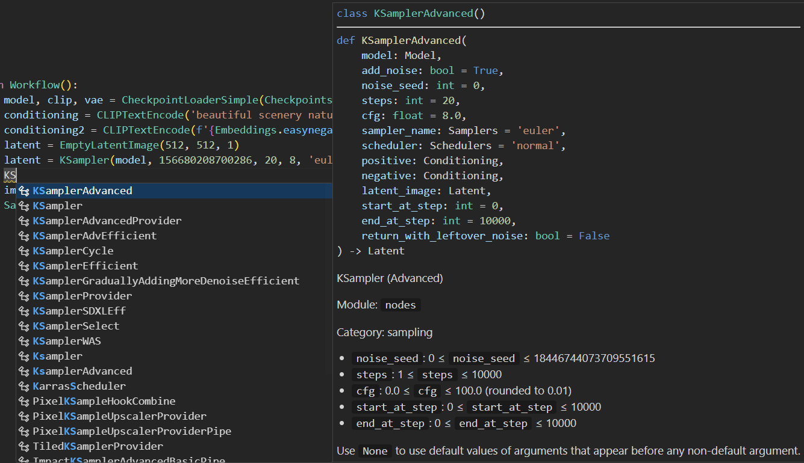

# ComfyScript
A Python front end and library for [ComfyUI](https://github.com/comfyanonymous/ComfyUI).


It has the following use cases:
- Serving as a [human-readable format](https://github.com/comfyanonymous/ComfyUI/issues/612) for ComfyUI's workflows.

  This makes it easy to compare and reuse different parts of one's workflows.
  
  It is also possible to train LLMs to generate workflows, since many LLMs can handle Python code relatively well. This approach can be more powerful than just asking LLMs for some hardcoded parameters.

  Scripts can be automatically translated from ComfyUI's workflows. See [transpiler](#transpiler) for details.

- Directly running the script to generate images.

  The main advantage of doing this is being able to mix Python code with ComfyUI's nodes, like doing loops, calling library functions, and easily encapsulating custom nodes. This also makes adding interaction easier since the UI and logic can be both written in Python. And, some people may feel more comfortable with simple Python code than a graph-based GUI.

  See [runtime](#runtime) for details. Scripts can be executed locally or remotely with a ComfyUI server.

- Using ComfyUI as a function library.

  You can use ComfyUI's nodes as functions to do ML research, reuse nodes in other projects, debug nodes, and optimize caching to run workflows faster.

  See runtime's [real mode](docs/Runtime.md#real-mode) for details.

- Generating ComfyUI's workflows with scripts.

  You can run scripts to generate ComfyUI's workflows and then use them in the web UI or elsewhere. This way, you can use loops and generate huge workflows where it would be time-consuming or impractical to create them manually. See [workflow generation](docs/Runtime.md#workflow-generation) for details.

- Retrieving any wanted information by running the script with some stubs.

  For example, to get all positive prompt texts, one can define:

  ```python
  positive_prompts = []

  def CLIPTextEncode(text, clip):
      return text
  
  def KSampler(model, seed, steps, cfg, sampler_name, scheduler, positive, negative, latent_image, denoise):
      positive_prompts.append(positive)
  ```
  And use [`exec()`](https://docs.python.org/3/library/functions.html#exec) to run the script (stubs for other nodes can be automatically generated). This way, `Reroute`, `PrimitiveNode`, and other special nodes won't be a problem stopping one from getting the information.

  It is also possible to generate a JSON by this. However, since JSON can only contain tree data and the workflow is a DAG, some information will have to be discarded, or the input have to be replicated at many positions.

- Converting workflows from ComfyUI's web UI format to API format without the web UI.

## Installation
You can install ComfyScript in different ways.

### Package and nodes with ComfyUI
Install [ComfyUI](https://github.com/comfyanonymous/ComfyUI) first. And then:
```sh
cd ComfyUI/custom_nodes
git clone --recurse-submodules https://github.com/Chaoses-Ib/ComfyScript.git
cd ComfyScript
python -m pip install -e .
```
(If you see `ERROR: File "setup.py" or "setup.cfg" not found`, run `python -m pip install -U pip` first.)

Update:
```sh
cd ComfyUI/custom_nodes/ComfyScript
git pull
git submodule update --init --recursive
python -m pip install -e .
```

### Package and nodes with ComfyUI package
Install [ComfyUI package](https://github.com/comfyanonymous/ComfyUI/pull/298) first:
```sh
python -m pip install git+https://github.com/hiddenswitch/ComfyUI.git
```

Install/update ComfyScript:
```sh
python -m pip install -U comfy-script
```

### Only nodes with ComfyUI
<details>

Install [ComfyUI](https://github.com/comfyanonymous/ComfyUI) first. And then:
```sh
cd ComfyUI/custom_nodes
git clone --recurse-submodules https://github.com/Chaoses-Ib/ComfyScript.git
cd ComfyScript
python -m pip install -r requirements.txt
```

Update:
```sh
cd ComfyUI/custom_nodes/ComfyScript
git pull
git submodule update --init --recursive
python -m pip install -r requirements.txt
```

If you want, you can still import the package with a hardcoded path:
```python
import sys
# Or just '../src' if used in the examples directory
sys.path.insert(0, r'D:\...\ComfyUI\custom_nodes\ComfyScript\src')

import comfy_script
```

</details>

### Only package
<details>

```sh
python -m pip install comfy-script
```

Update:
```sh
python -m pip install -U comfy-script
```

</details>

## Transpiler
The transpiler can translate ComfyUI's workflows to ComfyScript.

When this repository is installed, `SaveImage` and similar nodes will be hooked to automatically save the script as images' metadata. And the script will also be output to the terminal.

For example, here is a workflow in ComfyUI:


ComfyScript translated from it:
```python
model, clip, vae = CheckpointLoaderSimple('v1-5-pruned-emaonly.ckpt')
conditioning = CLIPTextEncode('beautiful scenery nature glass bottle landscape, , purple galaxy bottle,', clip)
conditioning2 = CLIPTextEncode('text, watermark', clip)
latent = EmptyLatentImage(512, 512, 1)
latent = KSampler(model, 156680208700286, 20, 8, 'euler', 'normal', conditioning, conditioning2, latent, 1)
image = VAEDecode(latent, vae)
SaveImage(image, 'ComfyUI')
```

If there two or more `SaveImage` nodes in one workflow, only the necessary inputs of each node will be translated to scripts. For example, here is a 2 pass txt2img (hires fix) workflow:


ComfyScript saved for each of the two saved image are respectively:
1. ```python
   model, clip, vae = CheckpointLoaderSimple('v2-1_768-ema-pruned.ckpt')
   conditioning = CLIPTextEncode('masterpiece HDR victorian portrait painting of woman, blonde hair, mountain nature, blue sky', clip)
   conditioning2 = CLIPTextEncode('bad hands, text, watermark', clip)
   latent = EmptyLatentImage(768, 768, 1)
   latent = KSampler(model, 89848141647836, 12, 8, 'dpmpp_sde', 'normal', conditioning, conditioning2, latent, 1)
   image = VAEDecode(latent, vae)
   SaveImage(image, 'ComfyUI')
   ```
2. ```python
   model, clip, vae = CheckpointLoaderSimple('v2-1_768-ema-pruned.ckpt')
   conditioning = CLIPTextEncode('masterpiece HDR victorian portrait painting of woman, blonde hair, mountain nature, blue sky', clip)
   conditioning2 = CLIPTextEncode('bad hands, text, watermark', clip)
   latent = EmptyLatentImage(768, 768, 1)
   latent = KSampler(model, 89848141647836, 12, 8, 'dpmpp_sde', 'normal', conditioning, conditioning2, latent, 1)
   latent2 = LatentUpscale(latent, 'nearest-exact', 1152, 1152, 'disabled')
   latent2 = KSampler(model, 469771404043268, 14, 8, 'dpmpp_2m', 'simple', conditioning, conditioning2, latent2, 0.5)
   image = VAEDecode(latent2, vae)
   SaveImage(image, 'ComfyUI')
   ```

Comparing scripts:


You can also use the transpiler via the [CLI](docs/Transpiler.md#cli).

## Runtime
With the runtime, you can run ComfyScript like this:
```python
from comfy_script.runtime import *
load()
from comfy_script.runtime.nodes import *

with Workflow():
    model, clip, vae = CheckpointLoaderSimple('v1-5-pruned-emaonly.ckpt')
    conditioning = CLIPTextEncode('beautiful scenery nature glass bottle landscape, , purple galaxy bottle,', clip)
    conditioning2 = CLIPTextEncode('text, watermark', clip)
    latent = EmptyLatentImage(512, 512, 1)
    latent = KSampler(model, 156680208700286, 20, 8, 'euler', 'normal', conditioning, conditioning2, latent, 1)
    image = VAEDecode(latent, vae)
    SaveImage(image, 'ComfyUI')
```

A Jupyter Notebook example is available at [`examples/runtime.ipynb`](examples/runtime.ipynb). (Files under `examples` directory will be ignored by Git and you can put your personal notebooks there.)

- [Type stubs](https://typing.readthedocs.io/en/latest/source/stubs.html) will be generated at `comfy_script/runtime/nodes.pyi` after loading. Mainstream code editors (e.g. [VS Code](https://code.visualstudio.com/docs/languages/python)) can use them to help with coding:

  | | |
  | --- | --- |
  |  |  |

  [Enumerations](https://docs.python.org/3/library/enum.html) are generated for all arguments provding the value list. So instead of copying and pasting strings like `'v1-5-pruned-emaonly.ckpt'`, you can use:
  ```python
  CheckpointLoaderSimple.ckpt_name.v1_5_pruned_emaonly
  ```

- The runtime is asynchronous by default. You can queue multiple tasks without waiting for the first one to finish. A daemon thread will watch and report the remaining tasks in the queue and the current progress, for example:
  ```
  Queue remaining: 1
  Queue remaining: 2
  100%|██████████████████████████████████████████████████| 20/20
  Queue remaining: 1
  100%|██████████████████████████████████████████████████| 20/20
  Queue remaining: 0
  ```
  Some control functions are also available:
  ```python
  # Interrupt the current task
  queue.cancel_current()
  # Clear the queue
  queue.cancel_remaining()
  # Interrupt the current task and clear the queue
  queue.cancel_all()
  # Call the callback when the queue is empty
  queue.when_empty(callback)

  # With Workflow:
  Workflow(cancel_remaining=True)
  Workflow(cancel_all=True)
  ```

See [differences from ComfyUI's web UI](docs/Runtime.md#differences-from-comfyuis-web-ui) if you are a previous user of ComfyUI's web UI, and [runtime](docs/Runtime.md) for the details of runtime.

### Examples
#### Plotting
```python
with Workflow():
    seed = 0
    pos = 'sky, 1girl, smile'
    neg = 'embedding:easynegative'
    model, clip, vae = CheckpointLoaderSimple(CheckpointLoaderSimple.ckpt_name.AOM3A1B_orangemixs)
    model2, clip2, vae2 = CheckpointLoaderSimple(CheckpointLoaderSimple.ckpt_name.CounterfeitV25_25)
    model2 = TomePatchModel(model2, 0.5)
    for color in 'red', 'green', 'blue':
        latent = EmptyLatentImage(440, 640)
        latent = KSampler(model, seed, steps=15, cfg=6, sampler_name='uni_pc',
                          positive=CLIPTextEncode(f'{color}, {pos}', clip), negative=CLIPTextEncode(neg, clip),
                          latent_image=latent)
        SaveImage(VAEDecode(latent, vae2), f'{seed} {color}')
        latent = LatentUpscaleBy(latent, scale_by=2)
        latent = KSampler(model2, seed, steps=15, cfg=6, sampler_name='uni_pc',
                          positive=CLIPTextEncode(f'{color}, {pos}', clip2), negative=CLIPTextEncode(neg, clip2),
                          latent_image=latent, denoise=0.6)
        SaveImage(VAEDecode(latent, vae2), f'{seed} {color} hires')
```


#### Auto queue
Automatically queue new workflows when the queue becomes empty.

For example, one can use [comfyui-photoshop](https://github.com/NimaNzrii/comfyui-photoshop) (currently a bit buggy) to automatically do img2img with the image in Photoshop when it changes:
```python
def f(wf):
    seed = 0
    pos = '1girl, angry, middle finger'
    neg = 'embedding:easynegative'
    model, clip, vae = CheckpointLoaderSimple(CheckpointLoaderSimple.ckpt_name.CounterfeitV25_25)
    image, width, height = PhotoshopToComfyUI(wait_for_photoshop_changes=True)
    latent = VAEEncode(image, vae)
    latent = LatentUpscaleBy(latent, scale_by=1.5)
    latent = KSampler(model, seed, steps=15, cfg=6, sampler_name='uni_pc',
                        positive=CLIPTextEncode(pos, clip), negative=CLIPTextEncode(neg, clip),
                        latent_image=latent, denoise=0.8)
    PreviewImage(VAEDecode(latent, vae))
queue.when_empty(f)
```
Screenshot:


#### Select and process
For example, to generate 3 images at once, and then let the user decide which ones they want to hires fix:
```python
import ipywidgets as widgets

queue.watch_display(False, False)

latents = []
image_batches = []
with Workflow():
    seed = 0
    pos = 'sky, 1girl, smile'
    neg = 'embedding:easynegative'
    model, clip, vae = CheckpointLoaderSimple(CheckpointLoaderSimple.ckpt_name.AOM3A1B_orangemixs)
    model2, clip2, vae2 = CheckpointLoaderSimple(CheckpointLoaderSimple.ckpt_name.CounterfeitV25_25)
    for color in 'red', 'green', 'blue':
        latent = EmptyLatentImage(440, 640)
        latent = KSampler(model, seed, steps=15, cfg=6, sampler_name='uni_pc',
                          positive=CLIPTextEncode(f'{color}, {pos}', clip), negative=CLIPTextEncode(neg, clip),
                          latent_image=latent)
        latents.append(latent)
        image_batches.append(SaveImage(VAEDecode(latent, vae), f'{seed} {color}'))

grid = widgets.GridspecLayout(1, len(image_batches))
for i, image_batch in enumerate(image_batches):
    image_batch = image_batch.wait()
    image = widgets.Image(value=image_batch[0]._repr_png_())

    button = widgets.Button(description=f'Hires fix {i}')
    def hiresfix(button, i=i):
        print(f'Image {i} is chosen')
        with Workflow():
            latent = LatentUpscaleBy(latents[i], scale_by=2)
            latent = KSampler(model2, seed, steps=15, cfg=6, sampler_name='uni_pc',
                            positive=CLIPTextEncode(pos, clip2), negative=CLIPTextEncode(neg, clip2),
                            latent_image=latent, denoise=0.6)
            image_batch = SaveImage(VAEDecode(latent, vae2), f'{seed} hires')
        display(image_batch.wait())
    button.on_click(hiresfix)

    grid[0, i] = widgets.VBox(children=(image, button))
display(grid)
```
This example uses [ipywidgets](https://github.com/jupyter-widgets/ipywidgets) for the GUI, but other GUI frameworks can be used as well.

Screenshot:


## Additional nodes
See [nodes](nodes/README.md) for the addtional nodes installed with ComfyScript.