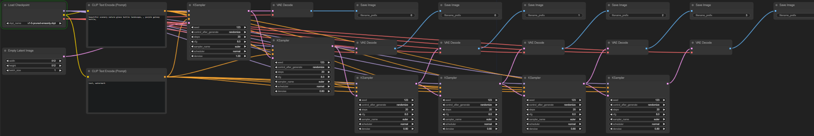

# Runtime
## Enumerations
[Python enumerations](https://docs.python.org/3/howto/enum.html) are generated for all arguments provding the value list. So instead of copying and pasting strings like `'v1-5-pruned-emaonly.ckpt'`, you can use:

```python
CheckpointLoaderSimple.ckpt_name.v1_5_pruned_emaonly
```

Because this form is a bit tedious, some enums are also available in a shorter form. For example:
```python
Checkpoints.v1_5_pruned_emaonly
```
These enums are called "global enums". See the following section for all global enums.

### Global enums
Models:

Enum id | Models folder | sd-webui folder (`extra_model_paths.yaml`)
--- | --- | ---
`Checkpoints` | `checkpoints` | `Stable-diffusion`
`CLIPs` | `clip`
`CLIPVisions` | `clip_vision`
N/A <br />(`CheckpointLoader.config_name`) | `configs` | `Stable-diffusion`
`ControlNets` | `controlnet` | `ControlNet`
`Diffusers` | `diffusers`
`Embeddings` | `embeddings` | `embeddings`
`GLIGENs` | `gligen`
`Hypernetworks` | `hypernetworks` | `hypernetworks`
`Loras` | `loras` | `Lora`, `LyCORIS`
`PhotoMakers` | `photomaker`
`StyleModels` | `style_models`
`UNETs` | `unet`
`UpscaleModels` | `upscale_models` | `ESRGAN`, `RealESRGAN`, `SwinIR`
`VAEs` | `vae`, `vae_approx` | `VAE`

(Note that for convenience, the values of `Embeddings` are in the format of `embedding:my-embedding`. The name itself (`my-embedding`) can be obtained from `Embeddings.my_embedding.name()`.)

Others:

Enum id | Local enum | ComfyUI id
--- | --- | ---
`Samplers` | `KSampler.sampler_name` | `comfy.samplers.KSampler.SAMPLERS`
`Schedulers` | `KSampler.scheduler` | `comfy.samplers.KSampler.SCHEDULERS`

## Virtual mode
In the default mode - virtual mode, scripts are executed by a ComfyUI server, locally or remotely.

The main limitation of virtual mode is that one cannot get the output of nodes from Python before running the full workflow. However, this limitation can be mitigated by expanding a workflow dynamically and run it multiple times. See [select and process](../README.md#select-and-process) for an example. (If [#931](https://github.com/comfyanonymous/ComfyUI/pull/931) is someday merged into ComfyUI, this limitation can be solved.)

Another solution to the above limitation is to use [real mode](#real-mode).

### Workflow generation
In virtual mode, you can get a workflow's API format by calling `api_format_json()`. For example, to generate a loopback (do multiple times img2img on the same image) workflow:
```python
with Workflow(queue=False) as wf:
    model, clip, vae = CheckpointLoaderSimple('v1-5-pruned-emaonly.ckpt')
    conditioning = CLIPTextEncode('beautiful scenery nature glass bottle landscape, , purple galaxy bottle,', clip)
    conditioning2 = CLIPTextEncode('text, watermark', clip)
    latent = EmptyLatentImage(512, 512, 1)
    latent = KSampler(model, 123, 20, 8, 'euler', 'normal', conditioning, conditioning2, latent, 1)
    SaveImage(VAEDecode(latent, vae), '0')
    for i in range(5):
        latent = KSampler(model, 123, 20, 8, 'euler', 'normal', conditioning, conditioning2, latent, 0.8)
        SaveImage(VAEDecode(latent, vae), f'{i}')

json = wf.api_format_json()
with open('prompt.json', 'w') as f:
    f.write(json)
```
This only generates workflows in the API format. But ComfyUI can automically convert API format workflows to the web UI format when you load them ([#1932](https://github.com/comfyanonymous/ComfyUI/pull/1932)):



You can also load workflows from images generated by ComfyScript.

Note: You may get slightly different results when using the generated workflow in the web UI compared to using it in ComfyScript. See [differences from ComfyUI's web UI](#differences-from-comfyuis-web-ui) for the reason.

### Async support
Virtual mode is internally asynchronous, but only exposes synchronous APIs for the following reasons:
- To make the script more friendly to Python newbies
- To avoid being infectious
  
  Some libraries, such as ipywidgets, do not support async yet.
- To make scripts shorter

If you want to use the asynchronous APIs, you need to:
- Prefix all APIs support async with an underscore and await
  
  For example:
  - `load()` → `await runtime._load()`
  - `queue.cancel_all()` → `await queue._cancel_all()`
  - `obj.display()` (and `display(obj)`) → `await obj._display()`
- Replace `with Workflow` with `async with Workflow`
- Replace `obj.wait()` with `await obj`, `obj.wait_result()` with `await obj.result()`
- Replace `ImageBatchResult[i]` with `await ImageBatchResult.get(i)`

## Real mode
In virtual mode, calling a node is not executing it. Instead, the entire workflow will only get executed when it is sent to ComfyUI's server, by generating workflow JSON from the workflow (`wf.api_format_json()`).

In real mode, calling a node will execute it directly:
```python
print(CheckpointLoaderSimple('v1-5-pruned-emaonly.ckpt'))
# (<comfy.model_patcher.ModelPatcher object at 0x000002198721ECB0>, <comfy.sd.CLIP object at 0x000002198721C250>, <comfy.sd.VAE object at 0x000002183B128EB0>)
```

Real mode is thus more flexible and powerful than virtual mode. It can be used to:
- Doing ML research.

- Reuse custom nodes in other projects.

  Besides research projects and commercial products, it is also possible to integrate ComfyUI into sd-webui. This way, a feature can be implemented as a node once and then be used in both ComfyUI and sd-webui.

- Making developing custom nodes easier.

- Optimizing caching to run workflows faster.

  Because real mode executes the nodes directly, it cannot utilize ComfyUI's cache system. But if the lifetime of variables are maintained carefully enough, it is possible to run workflows faster than ComfyUI, since ComfyUI's cache system uses a naive single-slot cache.

Differences from virtual mode:
- Scripts cannot be executed through the API of a ComfyUI server.

  However, it is still possible to run scripts on a remote machine without the API. For example, you can launching a [Jupyter Server](https://jupyter-server.readthedocs.io/en/latest/) and [connect to it remotely](https://code.visualstudio.com/docs/datascience/jupyter-notebooks#_connect-to-a-remote-jupyter-server).

- As mentioned above, nodes will not cache the output themselves. It is the user's responsibility to avoid re-executing nodes with the same inputs.

- The outputs of output nodes (e.g. `SaveImage`) is not converted to result classes (e.g. `ImageBatchResult`).

  This may be changed in future versions.

- Each node's module name will be added to their docstrings in the type stubs.

  This can be used to figure out where a node came from.

A complete example:
```python
from comfy_script.runtime.real import *
load()
from comfy_script.runtime.real.nodes import *

# Or: with torch.inference_mode()
with Workflow():
    model, clip, vae = CheckpointLoaderSimple('v1-5-pruned-emaonly.ckpt')
    print(model, clip, vae, sep='\n')
    # <comfy.model_patcher.ModelPatcher object at 0x000002198721ECB0>
    # <comfy.sd.CLIP object at 0x000002198721C250>
    # <comfy.sd.VAE object at 0x000002183B128EB0>

    conditioning = CLIPTextEncode('beautiful scenery nature glass bottle landscape, , purple galaxy bottle,', clip)
    conditioning2 = CLIPTextEncode('text, watermark', clip)
    print(conditioning2)
    # [[
    #   tensor([[
    #     [-0.3885, ..., 0.0674],
    #     ...,
    #     [-0.8676, ..., -0.0057]
    #   ]]),
    #   {'pooled_output': tensor([[-1.2670e+00, ..., -1.5058e-01]])}
    # ]]

    latent = EmptyLatentImage(512, 512, 1)
    print(latent)
    # {'samples': tensor([[
    #   [[0., ..., 0.],
    #     ...,
    #    [0., ..., 0.]],
    #   [[0., ..., 0.],
    #     ...,
    #    [0., ..., 0.]],
    #   [[0., ..., 0.],
    #     ...,
    #    [0., ..., 0.]],
    #   [[0., ..., 0.],
    #     ...,
    #    [0., ..., 0.]]
    # ]])}

    latent = KSampler(model, 156680208700286, 20, 8, 'euler', 'normal', conditioning, conditioning2, latent, 1)

    image = VAEDecode(latent, vae)
    print(image)
    # tensor([[
    #   [[0.3389, 0.3652, 0.3428],
    #     ...,
    #     [0.4277, 0.3789, 0.1445]],
    #   ...,
    #   [[0.6348, 0.5898, 0.5270],
    #     ...,
    #     [0.7012, 0.6680, 0.5952]]
    # ]])

    print(SaveImage(image, 'ComfyUI'))
    # {'ui': {'images': [
    #   {'filename': 'ComfyUI_00001_.png',
    #     'subfolder': '',
    #     'type': 'output'}
    # ]}}
```

## Naked mode
If you have ever gotten to know the internals of ComfyUI, you will realize that real mode is not completely real. Some changes were made to nodes to improve the development experience and keep the code compatible with virtual mode. If you want the real real mode, you can enable naked mode by `load(naked=True)`.

In naked mode, ComfyScript will not execute any code after `load()` (except `Workflow()`, with can be basically replaced with `torch.inference_mode()`).

An example:
```python
import random

from comfy_script.runtime.real import *
load(naked=True)
from comfy_script.runtime.real.nodes import *

# Or: with torch.inference_mode()
with Workflow():
    checkpointloadersimple = CheckpointLoaderSimple()
    checkpointloadersimple_4 = checkpointloadersimple.load_checkpoint(
        ckpt_name="sd_xl_base_1.0.safetensors"
    )

    emptylatentimage = EmptyLatentImage()
    emptylatentimage_5 = emptylatentimage.generate(
        width=1024, height=1024, batch_size=1
    )

    cliptextencode = CLIPTextEncode()
    cliptextencode_6 = cliptextencode.encode(
        text="evening sunset scenery blue sky nature, glass bottle with a galaxy in it",
        clip=checkpointloadersimple_4[1],
    )

    cliptextencode_7 = cliptextencode.encode(
        text="text, watermark", clip=checkpointloadersimple_4[1]
    )

    checkpointloadersimple_12 = checkpointloadersimple.load_checkpoint(
        ckpt_name="sd_xl_refiner_1.0.safetensors"
    )

    cliptextencode_15 = cliptextencode.encode(
        text="evening sunset scenery blue sky nature, glass bottle with a galaxy in it",
        clip=checkpointloadersimple_12[1],
    )

    cliptextencode_16 = cliptextencode.encode(
        text="text, watermark", clip=checkpointloadersimple_12[1]
    )

    ksampleradvanced = KSamplerAdvanced()
    vaedecode = VAEDecode()
    saveimage = SaveImage()

    for q in range(10):
        ksampleradvanced_10 = ksampleradvanced.sample(
            add_noise="enable",
            noise_seed=random.randint(1, 2**64),
            steps=25,
            cfg=8,
            sampler_name="euler",
            scheduler="normal",
            start_at_step=0,
            end_at_step=20,
            return_with_leftover_noise="enable",
            model=checkpointloadersimple_4[0],
            positive=cliptextencode_6[0],
            negative=cliptextencode_7[0],
            latent_image=emptylatentimage_5[0],
        )

        ksampleradvanced_11 = ksampleradvanced.sample(
            add_noise="disable",
            noise_seed=random.randint(1, 2**64),
            steps=25,
            cfg=8,
            sampler_name="euler",
            scheduler="normal",
            start_at_step=20,
            end_at_step=10000,
            return_with_leftover_noise="disable",
            model=checkpointloadersimple_12[0],
            positive=cliptextencode_15[0],
            negative=cliptextencode_16[0],
            latent_image=ksampleradvanced_10[0],
        )

        vaedecode_17 = vaedecode.decode(
            samples=ksampleradvanced_11[0], vae=checkpointloadersimple_12[2]
        )

        saveimage_19 = saveimage.save_images(
            filename_prefix="ComfyUI", images=vaedecode_17[0]
        )
```

As you may have noticed, naked mode is compatible with the code generated by [ComfyUI-to-Python-Extension](https://github.com/pydn/ComfyUI-to-Python-Extension). You can use it to convert ComfyUI's workflows to naked mode scripts.

## Differences from ComfyUI's web UI
In ComfyUI, the back end and the web UI use different formats of workflows. Things like "S&R" (Search and Replace), "mute", "bypass" and "group" only exist in the web UI's format, not in the back end's API format. Before sending the workflows to the back end, the web UI will perform S&R, remove muted and bypassed nodes, and ignore groups as they are just UI elements that have no effect on the back end.

In ComfyScript, S&R can be implemented with variables and [f-strings](https://docs.python.org/3/tutorial/inputoutput.html#formatted-string-literals):
```python
pos = 'beautiful scenery nature glass bottle landscape, , purple galaxy bottle,'
neg = 'text, watermark'
seed = 123
steps = 20
model, clip, vae = CheckpointLoaderSimple('v1-5-pruned-emaonly.ckpt')
latent = EmptyLatentImage(512, 512, 1)
latent = KSampler(model, seed, steps, 8, 'euler', 'normal', CLIPTextEncode(pos, clip), CLIPTextEncode(neg, clip), latent, 1)
SaveImage(VAEDecode(latent, vae), f'{seed} {steps}')
```

For mute and bypass, you can comment the code (<kbd><kbd>Ctrl</kbd>+<kbd>/</kbd></kbd> in VS Code):
```python
model, clip, vae = CheckpointLoaderSimple('v1-5-pruned-emaonly.ckpt')
conditioning = CLIPTextEncode('beautiful scenery nature glass bottle landscape, , purple galaxy bottle,', clip)
conditioning2 = CLIPTextEncode('text, watermark', clip)
latent = EmptyLatentImage(512, 512, 1)

# "mute"
# latent = KSampler(model, 156680208700286, 20, 8, 'euler', 'normal', conditioning, conditioning2, latent, 1)
# image = VAEDecode(latent, vae)
# SaveImage(image, 'ComfyUI')

# "bypass"
# latent = KSampler(model, 156680208700286, 20, 8, 'euler', 'normal', conditioning, conditioning2, latent, 1)
image = VAEDecode(latent, vae)
SaveImage(image, 'ComfyUI')
```
Or use `if`:
```python
sample = False
save = True

model, clip, vae = CheckpointLoaderSimple('v1-5-pruned-emaonly.ckpt')
conditioning = CLIPTextEncode('beautiful scenery nature glass bottle landscape, , purple galaxy bottle,', clip)
conditioning2 = CLIPTextEncode('text, watermark', clip)
latent = EmptyLatentImage(512, 512, 1)
if sample:
    latent = KSampler(model, 156680208700286, 20, 8, 'euler', 'normal', conditioning, conditioning2, latent, 1)
if save:
    image = VAEDecode(latent, vae)
    SaveImage(image, 'ComfyUI')
```

For groups, you can just put related code together:
```python
pos = 'beautiful scenery nature glass bottle landscape, , purple galaxy bottle,'
neg = 'text, watermark'

# Model
model, clip, vae = CheckpointLoaderSimple('v1-5-pruned-emaonly.ckpt')

# Sampling
seed = 123
steps = 20
latent = EmptyLatentImage(512, 512, 1)
latent = KSampler(model, seed, steps, 8, 'euler', 'normal', CLIPTextEncode(pos, clip), CLIPTextEncode(neg, clip), latent, 1)

# Save
SaveImage(VAEDecode(latent, vae), f'{seed} {steps}')
```
Or define functions:
```python
def generate_image(pos, neg, seed, steps):
    model, clip, vae = CheckpointLoaderSimple('v1-5-pruned-emaonly.ckpt')
    latent = EmptyLatentImage(512, 512, 1)
    latent = KSampler(model, seed, steps, 8, 'euler', 'normal', CLIPTextEncode(pos, clip), CLIPTextEncode(neg, clip), latent, 1)
    SaveImage(VAEDecode(latent, vae), f'{seed} {steps}')

pos = 'beautiful scenery nature glass bottle landscape, , purple galaxy bottle,'
neg = 'text, watermark'
generate_image(pos, neg, seed=123, steps=20)
```

Also, for multiple line strings and raw strings:
```python
pos = '''beautiful scenery nature glass bottle landscape, 
purple galaxy bottle,'''
# or
pos = (
'''beautiful scenery nature glass bottle landscape, 
purple galaxy bottle,''')

image = LoadImageFromPath(r'ComfyUI_00001_-assets\ComfyUI_00001_.png [output]')
```

Other minor differences:
- No limitations on input precision and range.

  For example, in the web UI, `ImageScaleBy`'s `scale_by` has a minimum precision of 0.01, it is impossible to use a value like `0.375`, but only `0.38` (even if the workflow is generated by ComfyScript). But in ComfyScript, there is no such limitations.