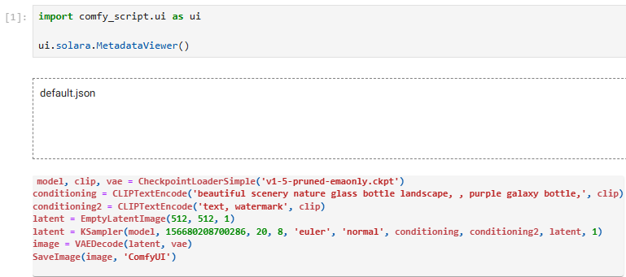

# Solara UI
These Solara widgets can be used in Jupyter Notebook and in web pages. To use them, ComfyScript must be installed with the `solara` feature:
- With ComfyUI: `pip install -e ".[default,solara]"`
- With ComfyUI package: `pip install "comfy-script[default,solara]"`

## MetadataViewer
A widget for viewing the metadata of an image generated by ComfyScript / ComfyUI / Stable Diffusion web UI. Workflow JSON files are supported too, including both the web UI format and the API format.



Usage:
```python
import comfy_script.ui as ui

ui.solara.MetadataViewer()
```

- For images, only PNG format is supported at the moment.

- Syntax highlighting does not work in Jupyter Notebook and VS Code, but only in JupyterLab and web pages.

- If you are using VS Code and cannot drag and drop files into it, make sure the version of your Jupyter extension is at least v2024.1.100.