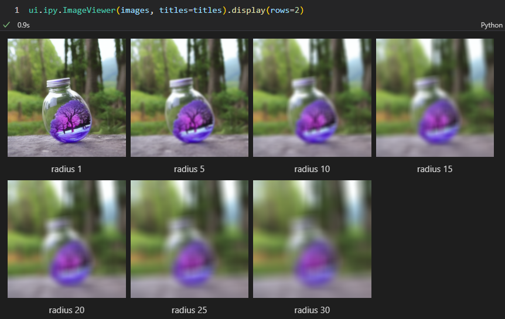

# ipywidgets UI
## ImageViewer
A simple image viewer that can display multiple images with optional titles.

[Example](../../examples/ui.ipynb):
```python
import comfy_script.ui as ui

def gen(x):
    image, _ = LoadImage(r'D:\ComfyUI\output\test_00001_.png')
    image = ImageBlur(image, x)
    return PreviewImage(image).wait()

images = []
titles = []
for x in [1, 5, 10, 15, 20, 25, 30]:
    title = f'radius {x}'
    print(title)
    images.append(gen(x))
    titles.append(title)
ui.ipy.ImageViewer(images, titles=titles)
```


It is also possible to specify the number of rows/columns and height/width of each image. For example:
```python
ui.ipy.ImageViewer(images, titles=titles).display(rows=2)
```
